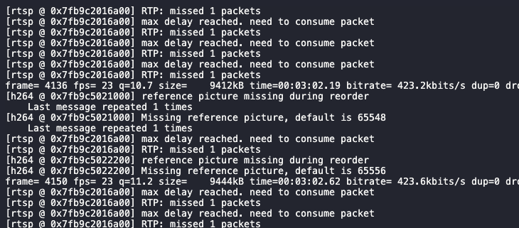

# 视频直播demo效果
https://user-images.githubusercontent.com/24558814/150983651-e95fa5ab-d89e-465c-a853-3642f0c1a62a.mov
# 一、前端服务端

> 基于create-react-app创建的react项目，使用 craco 替代 react-script 进行个性化配置

react
react-router
redux:
react-redux
@reduxjs/toolkit
## 1. 安装

项目开发人员可安装 npm 或者 yarn 进行包管理，进入项目根目录，运行：
// 安装项目依赖，等待安装完成之后

```bash
  yarn
```
## 2.本地开发环境运行

```bash
  yarn start
```

## 3.打包命令

```bash
  yarn build
```

# 二、node服务端

> video/audio-> ffmpeg -> node -> websock -> H5

## 1. 环境

- 一段.mp4视频
- ffmpeg （mac上安装brew install ffmpeg）
- node
- 下载jsmpeg.min.js（https://jsmpeg.com/jsmpeg.min.js）


```shell
// 安装 
 brew install ffmpeg
// 生成ts视频
ffmpeg -i loop_moon.mp4 -f mpegts \
    -codec:v mpeg1video -s 960x540 -b:v 1500k -r 30 -bf 0 \
    -codec:a mp2 -ar 44100 -ac 1 -b:a 128k \
    loop_moon.ts

还可以控制视频大小（-s），帧速率（-r），视频比特率（-b：v），音频比特率（-b：a），音频通道数（-ac），采样率（-ar ） 
```

## 2. 服务器运行

```shell
yarn node
```

运行ffmpeg将.mp4视频流转换为.ts视频流
TS（Transport Stream,传输流）是一种封装的格式，它的全称为MPEG2- TS。是一种视频格式，一般用于实时流媒体
转换原因：MP4在IOS下可以自动播放，但是在部分安卓机下无法自动播放产生黑屏.TS 可实现自动播放，IOS8以上和Android4.4以上都支持。基于自动播放的优势

运行效果：

